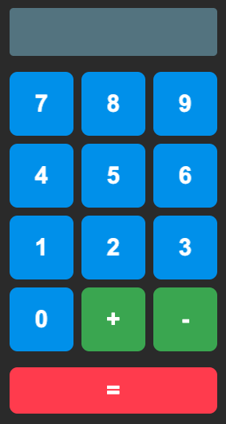

# About

An end to end example of flutter, grpc-web and golang running on minikube kubernetes. Future work will show this on Google Kuberenetes Engine with SSL.

# Setup

## Install prerequisites

- [skaffold](https://skaffold.dev/docs/install/)
- [flutter](https://flutter.dev)
- [golang](https://golang.org)
- [minikube](https://kubernetes.io/docs/tasks/tools/install-minikube/)
- [kubectl](https://kubernetes.io/docs/tasks/tools/install-kubectl/)
- [docker](https://www.docker.com)

## Start minikube

```
$ minikube start
```

Below was my configuration `$ minikube config view`
```
- cpus: 2
- dashboard: true
- kubernetes-version: 1.13.11
- memory: 8192
- vm-driver: hyperkit
```

## Build and deploy

```
$ make deploy
```

**Note: This will take a while the first time you run this**

## Tunnel minikube

```
$ minikube tunnel
```

## Open frontend

```
$ make open
```

You should see the following in your browser.  Adding and subtracting is accomplished using the gRPC server and it sends the results back to the browser.

